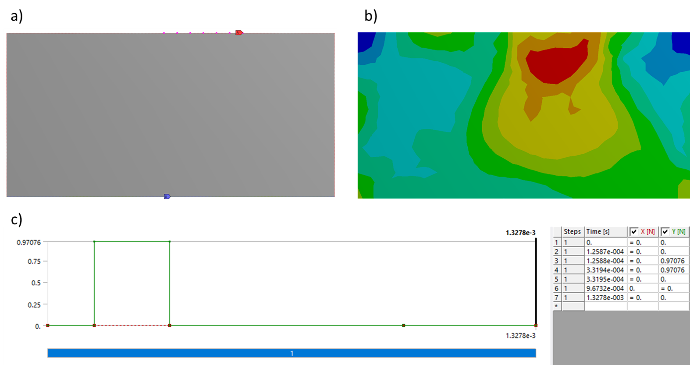
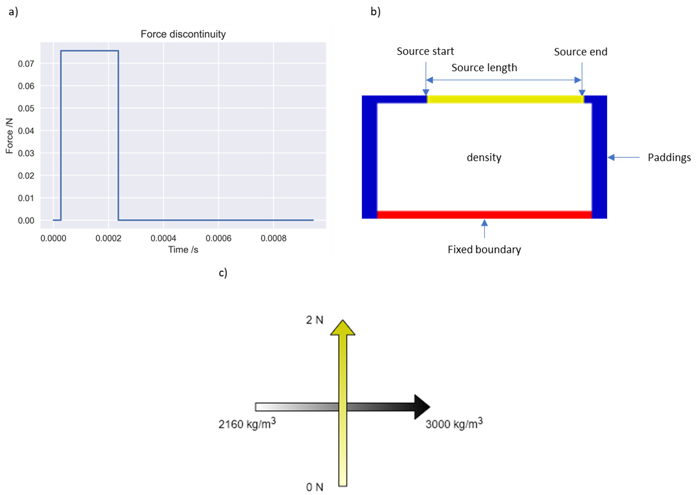
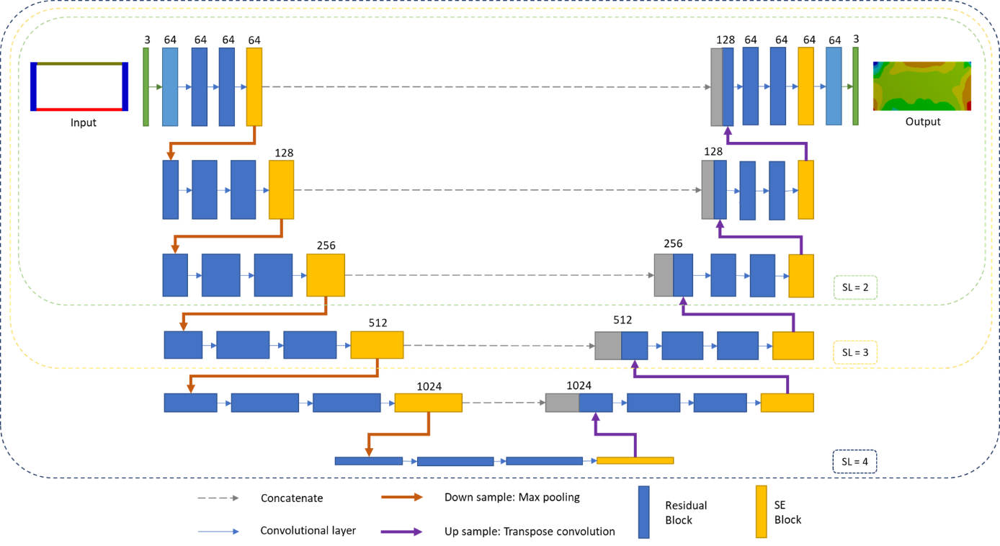
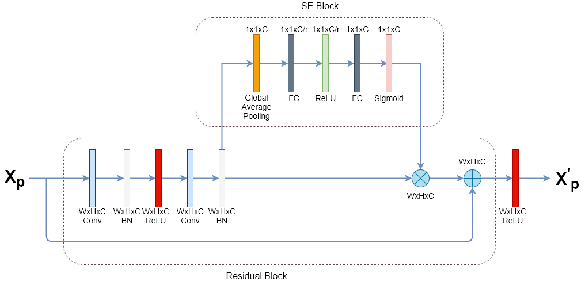
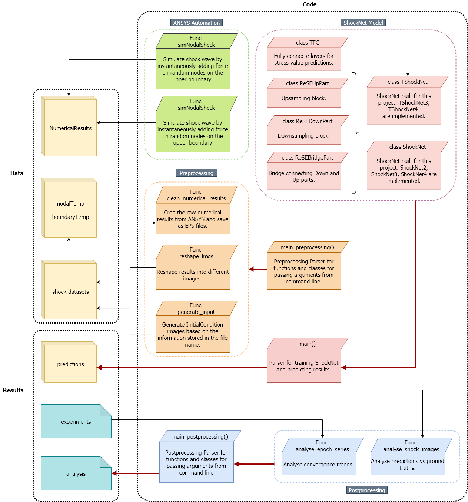
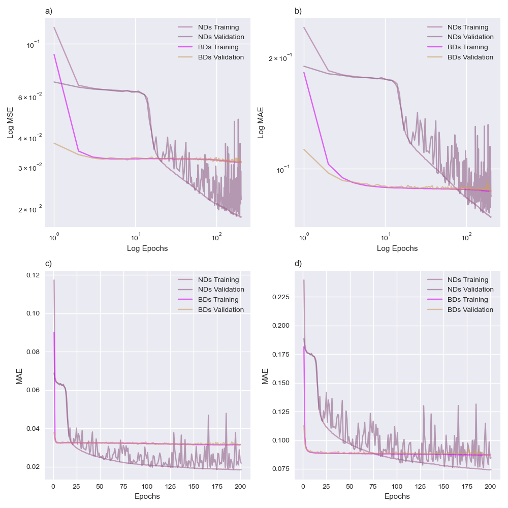
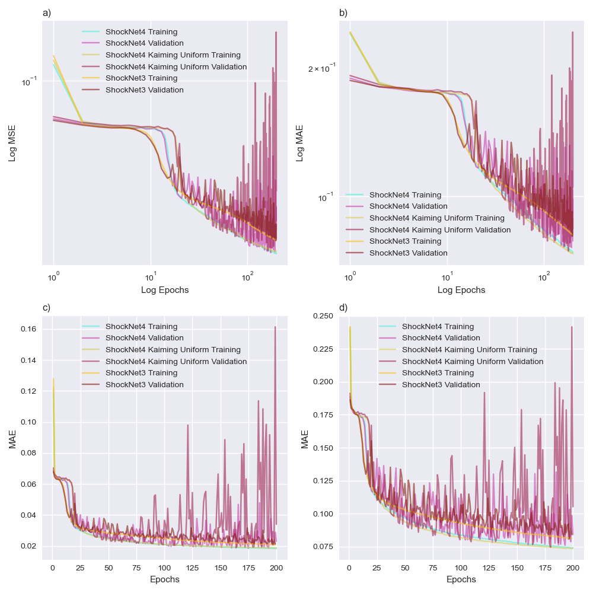

# ACSE Independent Project

## A Deep Learning Approach to Identify Maximum Stress Distribution Caused by Shock Wave in Geo-mechanical Materials

### 1. Project Description

This project aimed to explore the potential of neural networks as an alternative approach to predict stress distribution when a shockwave is cast on a domain in 2D. The stress distribution is tracked when the maximum stress overtime occurred. Randomised shockwaves were simulated to increase the variance of the dataset. ANSYS Student Edition, an open-source finite element analysis (FEA) software was used to generate stress distribution images and initial condition images were projected via saved boundary conditions, force allocations, material densities, etc. ShockNet, an encoder-decoder, has been designed to extract features from initial condition inputs in a multi-scaled way. Both 3-level and 4-level ShockNets showed good convergence trends within 250 epochs and abilities to render the initial condition inputs into stress contour predictions. TShockNet was also implemented which could also predict numeric maximum and minimum stress values of the result stress field.

### 2. Data Generation

This section introduces how data were generated to feed ShockNets. 

#### 2.1. Predicting Stress Fields Numerically

ANSYS Student Edition ([ANSYS-SE](https://www.ansys.com/en-gb/academic/free-student-products)) provides open-source numerical modelling software packages, where the Explicit Module can be used to simulate events within a short period, e.g. shock propagation. A 2D rectangle was initialised as the domain in this project. The domain was assigned with six different materials: sandstones, dolomite, limestone, granite, basalt and chalks. The lower boundary was set as fixed where the shock would be loaded on the upper boundary.

Heaviside step function was widely used to simulate a shock wave:

$$H(E) = \begin{cases} E,&{if\ t\in[t_{start}, t_{end}]} \\ 0,&others \end{cases}$$

where $E$ stands for the kinetic energy for each node and $t_{start}$ and $t_{end}$ define when the shock was added to upper boundary. Figure 1 shows screenshots of established domain in ANSYS-SE and the initialisations. Initial conditions and simulated maximum and minimum stress values were saved as the name of the predicted stress field.
|  |
| :--------------------------------------: |
| *Figure1* : Screenshots from ANSYS-SE. a) and b) were examples for the initial condition and solved results from ANSYS-SE. The lower part c) refers to discontinuities in force. |

#### 2.2. Initial Condition Projection
From the saved initial conditions saved in the file name, initial conditions have been projected into RGB channelled images as shown in figure3. 
|  |
| :--------------------------------------: |
| *Figure2* : Initial condition projection examples. Figure a) denotes the force discontinuity cast on the source (dark yellow) in figure b). b) illustrates the components in an initial condition image and c) explains how the colour scale related to the physical parameters. |

### 3. ShockNet
ShockNet was designed based on following conceptions:
1. U-Net: encoder-decoder structure (Ronneberger et al., 2015)
2. Residual block: enable deeply structured neural network without gradient vanishing (Kaiming et al., 2017)
3. Squeeze and excitation block: improve learning abilities with negligible computational cost in addition (Hu et al., 2017)

The general architecture of ShockNet was shown in figure3 and for each depth/level, the structure was zoomed in in figure4. 
|  |
| :--------------------------------------: |
| *Figure3* : ShockNet architecture. SL numbers were labelled with the defined scope. Red and purple arrows represent max pooling and transpose convolution layers. |

|  |
| :--------------------------------------: |
| *Figure4* : A ShockNet block at one SL. Each residual block contains two convolutional blocks, followed by a batch normalisation for each. A copy of Xp was reserved. The output from the second batch normalisation layer would be (1) sent to the SE block and (2) saved as a copy. Channel-wise scales are output by the SE block and multiply with the saved copy. The multiplied result would then be added with the reserved copy of Xp. |

### 4. Code Structure and Utilities
Figure6 illustrated how codes in this project were managed and structured. The workflow could be summarised in following steps:
1. Run automated simulations in ANSYS-SE ([automation](./Code/automation/))
|  |
| :--------------------------------------: |
|       *Figure5* : Code structure.        |

### 5. Results
|  |
| :--------------------------------------: |
| *Figure6* : Comparison of ShockNet4 between training with BDs and training with BDs. Figure a) and b) refer to log-log plots. |

|  |
| :--------------------------------------: |
| *Figure7* : Convergence comparisons. Each graph contains training and validation MSE and MAE of experimenting with (1) ShockNet4 using KNI, (2) ShockNet4 using KUI, and (3) ShockNet3 using KNI. Figure a) and b) refer to log-log plots. |

#### 