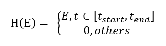
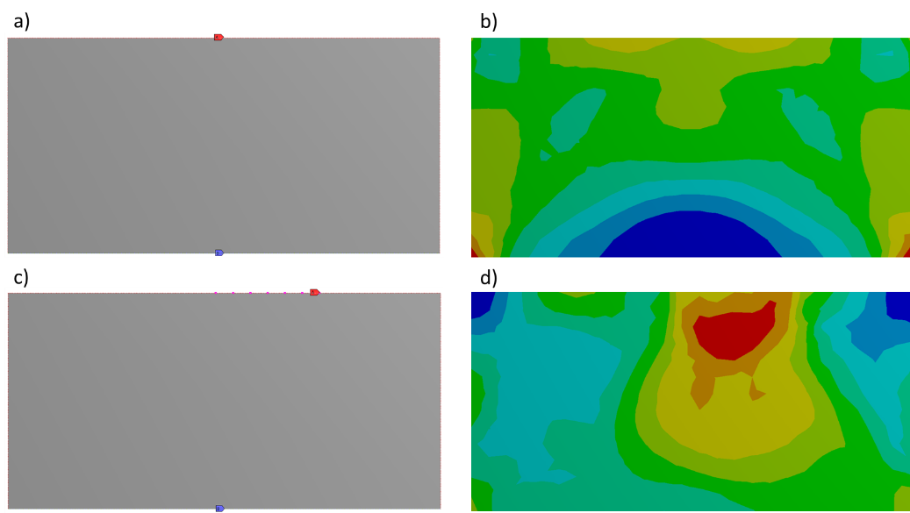
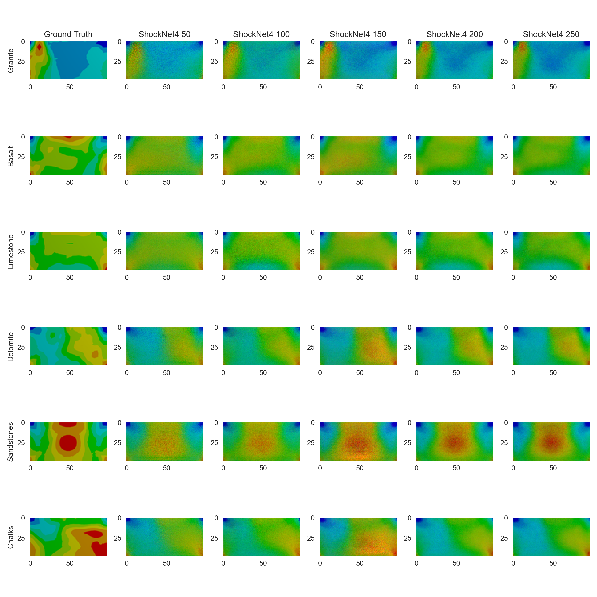
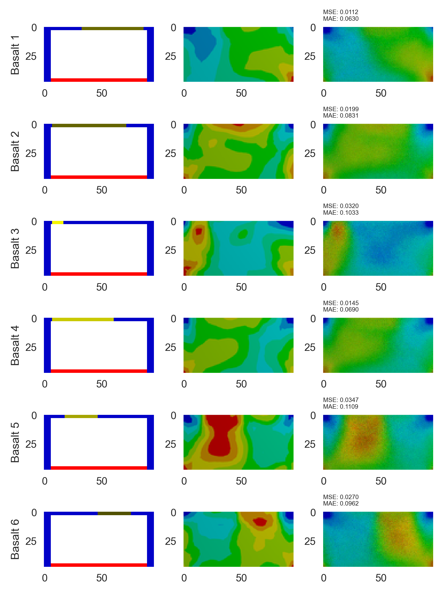
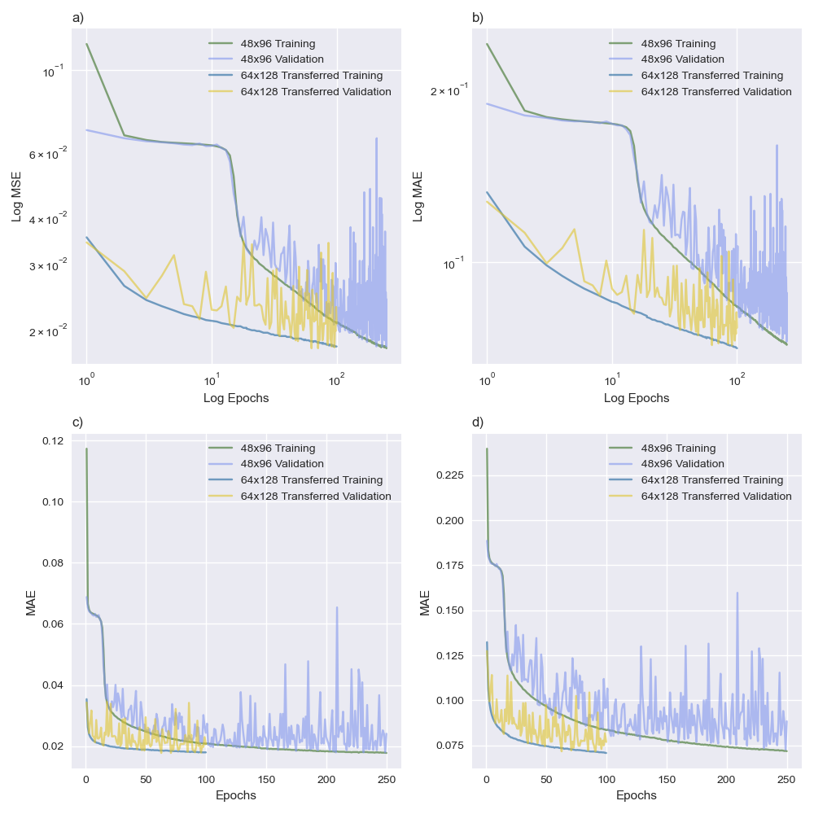

# ACSE Independent Project

## A Deep Learning Approach to Identify Maximum Stress Distribution Caused by Shock Wave in Geo-mechanical Materials

### Contents

1. [Project Description](#1.-Project-Description)
2. [Data Generation](#2.-Data-Generation)
3. [ShockNet](#3.-ShockNet)
4. [Code Structure](#4.-Code-Structure-and-Utilities)
5. [Results](#5.-Results)
6. [References](#6.-References)

### 1. Project Description

This project aimed to explore the potential of neural networks as an alternative approach to predict stress distribution when a shockwave is cast on a domain in 2D. The stress distribution is tracked when the maximum stress overtime occurred. Randomised shockwaves were simulated to increase the variance of the dataset. ANSYS Student Edition, an open-source finite element analysis (FEA) software was used to generate stress distribution images. ShockNet, an encoder-decoder, has been designed to extract features from initial condition inputs in a multi-scaled way. 

### 2. Data Generation

This section introduces how data were generated to feed ShockNets. 

#### 2.1. Predicting Stress Fields Numerically

ANSYS Student Edition ([ANSYS-SE](https://www.ansys.com/en-gb/academic/free-student-products)) provides open-source numerical modelling software packages, where the Explicit Module can be used to simulate events within a short period, e.g. shock propagation. A 2D rectangle was initialised as the domain in this project. The domain was assigned with six different materials: sandstones, dolomite, limestone, granite, basalt and chalks. The lower boundary was set as fixed where the shock would be loaded on the upper boundary.

Heaviside step function was widely used to simulate a shock wave (Villarreal 2006; Baty et al., 2007; Baty and Margolin, 2018):



where E stands for the kinetic energy for each node and is non-zero only if t is within the shock cast period. Figure 1 shows screenshots of established domain in ANSYS-SE and the initialisations. Initial conditions and simulated maximum and minimum stress values were saved as the name of the predicted stress field.
|  |
| :--------------------------------------: |
| *Figure 1* : Screenshots from ANSYS-SE. a) and b) were examples for the initial condition and solved results from ANSYS-SE. The lower part c) refers to discontinuities in force. |

Two types of datasets were generated: boundary datasets (BDs) and nodal datasets (NDs) and their effects on training ShockNet was discussed in [5](#5.-Results). The difference between BDs and NDs is the shock force allocation selection: BDs have the entire upper boundary loaded with the instantaneous force, whereas NDs only have randomly selected nodes on the upper boundary to be initialised.  Figure 2 shows the difference between BDs and NDs initial conditions and results from ANSYS-SE.
|  |
| :--------------------------------------: |
| *Figure 2* : Initial force and supporting conditions (left) and corresponding numerical results (right). a) & b) are examples with forces cast on the entire upper boundary where the numerical result showed symmetric stress field, whereas for c) & d) the load was added on randomly selected nodes which led to asymmetricity. |

#### 2.2. Initial Condition Projection
From the saved initial conditions saved in the file name, initial conditions have been projected into RGB channelled images as shown in Figure 3. 
|  |
| :--------------------------------------: |
| *Figure 3* : Initial condition projection examples. Figure a) denotes the force discontinuity cast on the source (dark yellow) in figure b). b) illustrates the components in an initial condition image and c) explains how the colour scale related to the physical parameters. |

### 3. ShockNet
ShockNet was designed based on following conceptions:
1. U-Net: encoder-decoder structure (Ronneberger et al., 2015)
2. Residual block: enable deeply structured neural network without gradient vanishing (Kaiming et al., 2017)
3. Squeeze and excitation block: improve learning abilities with negligible computational cost in addition (Hu et al., 2017)

The general architecture of ShockNet was shown in Figure 4 and for each depth/level, the structure was zoomed in in Figure 5. 
|  |
| :--------------------------------------: |
| *Figure 4* : ShockNet architecture. SL numbers were labelled with the defined scope. Red and purple arrows represent max pooling and transpose convolution layers. |

|  |
| :--------------------------------------: |
| *Figure 5* : A ShockNet block at one SL. Each residual block contains two convolutional blocks, followed by a batch normalisation for each. A copy of Xp was reserved. The output from the second batch normalisation layer would be (1) sent to the SE block and (2) saved as a copy. Channel-wise scales are output by the SE block and multiply with the saved copy. The multiplied result would then be added with the reserved copy of Xp. |

### 4. Code Structure and Utilities
Figure 6 illustrated how codes in this project were managed and structured. The workflow could be summarised in following steps:
1. Run [automation](./Code/automation/) codes to simulate via ANSYS-SE 
  * ------> [NumericalResults](./data/NumericalResults/)
2. Run [preprocessing](.Code/preprocessing/) scripts to clean, reshape, rename and restore ground truth stress fields 
  * ------> [shock-datasets](.data/shock-datasets)
3. Run [```main()```](./Code/main.py) using available GPU to run training sessions, save trained models and experiment results, and predict stress fields using saved ShockNets
  * ------> [experiments](./Code/experiments/)
  * ------> [predictions](./Code/predictions/)
4. Run [postprocessing](./Code/postprocessing/) codes to plot epoch series analysis, visual comparison between ground truths and ShockNet-predicted stress fields
  * ------> [analysis](./Code/analysis/)

To run codes in this project, instructions in details can be found [here](./Code/README.md)

|  |
| :--------------------------------------: |
|       *Figure 6* : Code structure.       |

### 5. Results
Results are showed in this sections. 

#### 5.1. Dataset Comparison
Figure 7 compared the trend of convergence when trained on BDs and NDs. ShockNet4 trained with BDs converged faster in a more stable pattern but stagnated after only ten epochs. By comparison, when trained with NDs, the ShockNet4 showed the consistent potential to reach lower loss for both MSE and MAE. 
|  |
| :--------------------------------------: |
| *Figure 7* : Comparison of ShockNet4 between training with BDs (boundary datasets) and training with NDs (nodal datasets). Figure a) and b) refer to log-log plots. |

#### 5.2. ShockNet Epoch Series
Figure 8 show the performance of ShockNet for different SL numbers and initialisation methods when trained with NDs. ShockNet4 was initialised with both Kaiming uniform (KUI) and normal initialisation (KNI) methods (ShockNet4-uni and ShockNet4-norm, respectively), and ShockNet3 initialised with KNI (ShockNet3-norm) was also added for parallel comparison. 

All three curves in Figure 8 show good convergence trends where the optimisers were working to reach the global minimum.
|  |
| :--------------------------------------: |
| *Figure 8* : Convergence comparisons. Each graph contains training and validation MSE and MAE of experimenting with (1) ShockNet4 using KNI, (2) ShockNet4 using KUI, and (3) ShockNet3 using KNI. Figure a) and b) refer to log-log plots. |

#### 5.3. Prediction Performance
ShockNet4 trained with different epochs were saved and reused to predict stress fields (Figure 9 & Figure 10). Samples were randomly extracted from the prediction subset. It took an average of 0.063s to generate a stress field prediction for ShockNet4 (on NVIDA’s Tesla P100-PCIE-16GB), comparing to the average time consumption of 20s with ANSYS-SE. 
|  |
| :--------------------------------------: |
| *Figure 9* : Visual comparisons between predicted maximum stress field and the ground truth result (first column). ShockNet4 was used to generate predictions. Rows represent different material samples, whereas the last five columns refer to the different number of epochs of which ShockNet4 had been trained for. |

|  |
| :--------------------------------------: |
| *Figure 10* : Results generated from ShockNet4 where corresponding initial conditions and ground truths are presented. MSE and MAE are calculated.  Basalt was selected as the sample material. |

#### 5.4. Transferred Learning Performance
Transferred learning shows that the ability of ShockNet to generalise what has been learnt to a new dataset of different resolution. Experiments on the performance of transferred learning were shown in Figure 11. 
|  |
| :--------------------------------------: |
| *Figure 11* : Comparison between ordinary learning using 48x96 dataset and transferred learning using 64x128 dataset. Parameters were inherited from the ShockNet4 after trained for 250 epochs with 48x96 dataset. |

### 6. References
* Baty, R.S. and Margolin, L.G., 2018. Modern infinitesimals and the entropy jump across an inviscid shock wave. International Journal of Aeroacoustics, 17(4-5), pp.502-520.
* Baty, R.S., Tucker, D.H. and Stanescu, D., 2008. Nonstandard jump functions for radially symmetric shock waves (No. LA-14380). Los Alamos National Laboratory (LANL), Los Alamos, NM.
* Villarreal, F., 2006. Heaviside generalized functions and shock waves for a Burger kind equation. Integral Transforms and Special Functions, 17(2-3), pp.213-219.
* Ronneberger, O., Fischer, P. and Brox, T., 2015, October. U-net: Convolutional networks for biomedical image segmentation. In International Conference on Medical image computing and computer-assisted intervention (pp. 234-241). Springer, Cham.
* He, K., Zhang, X., Ren, S. and Sun, J., 2016. Deep residual learning for image recognition. In Proceedings of the IEEE conference on computer vision and pattern recognition (pp. 770-778).
* Hu, J., Shen, L. and Sun, G., 2018. Squeeze-and-excitation networks. In Proceedings of the IEEE conference on computer vision and pattern recognition (pp. 7132-7141).